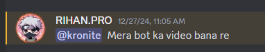
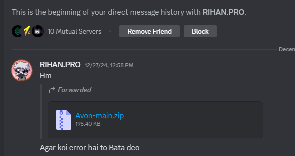

# Avon Music Bot  

Avon is a powerful and feature-rich Discord music bot designed to deliver seamless and high-quality music streaming. With cutting-edge libraries and optimizations, Avon ensures a smooth audio experience for your server.

---

## 🚀 Features  
- **Seamless Music Streaming**: Enjoy uninterrupted playback with advanced streaming capabilities.  
- **Shoukaku**: A high-performance Lavalink wrapper for efficient and lag-free audio streaming.  
- **Kazagumo**: A robust music manager built on Shoukaku, offering advanced queue management and playback controls.  
- **User-Friendly Commands**: A wide variety of easy-to-use music commands to elevate your server's entertainment.  

---
## 💡 Need a Custom Discord Bot?  
 These are just free codes for everyone to use.
 But if you're looking for something personalized, like:
 - A custom Discord bot with specific modules (AI, music, moderation, etc.)
 - A professional website or web application for your brand or project
 - Custom automation tools tailored to your needs

 discord: [discord.gg/teamkronix](https://discord.gg/MtNqTt8RUx),

---
## 📸 Screenshots  
 
  

  
 
---

## 📜 Disclaimer  

**Permission Granted**: This repository is uploaded with the explicit permission of the bot's owner, **Rihan**. The owner has granted full rights to publish this code on GitHub and share it publicly.  

*If you encounter any issues or have questions, please reach out through GitHub or Discord.*  

